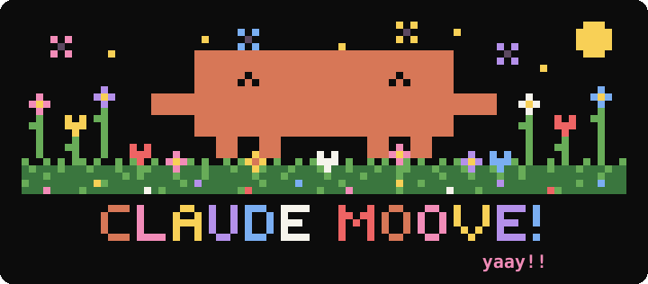
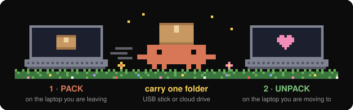
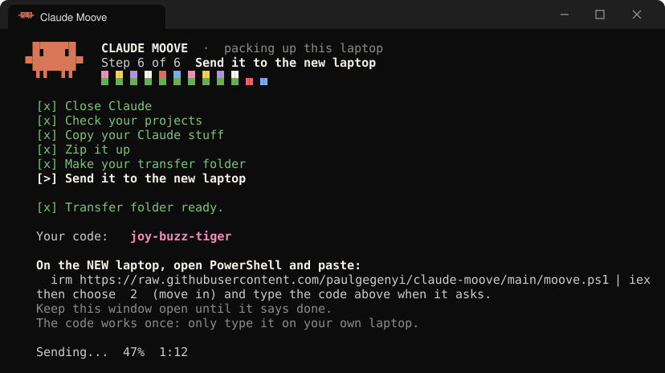
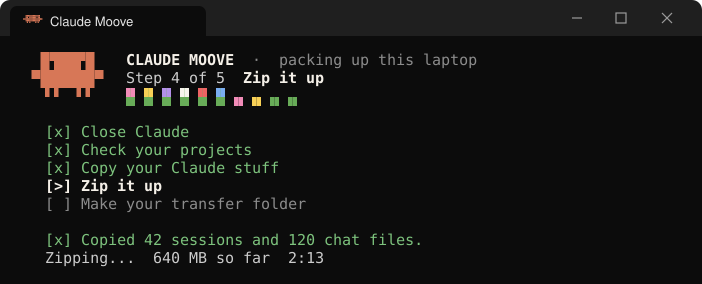
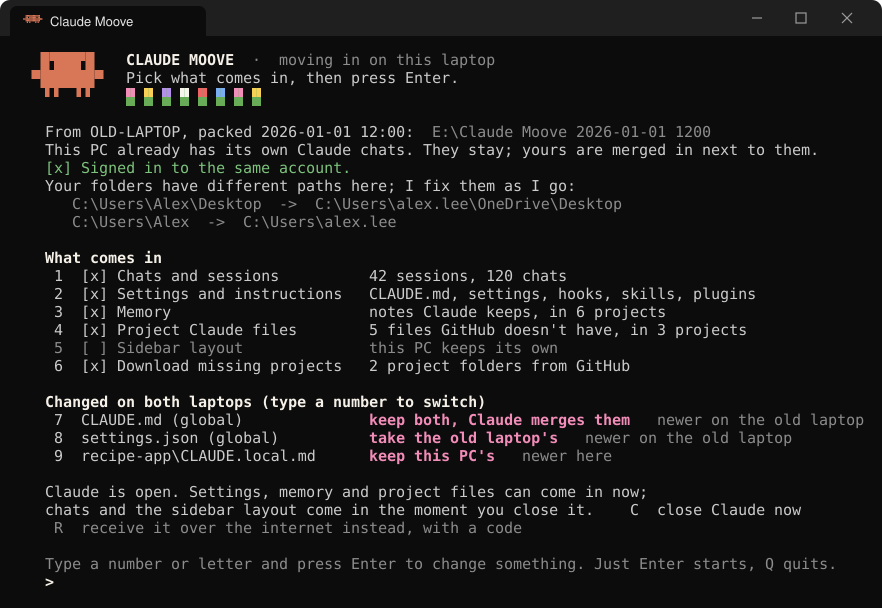

<p align="center">
  
</p>

<h3 align="center">Your Claude chats are coming with you 🌼</h3>

<p align="center">
  Move every chat, session, setting, hook, skill and memory to a new Windows laptop with <b>one copy-paste</b>.<br>
  A friendly little window walks you through it, and Clawd keeps you company in a field of flowers.
</p>

<p align="center">
  
  
  
  
</p>

<p align="center"></p>

## How it works

<p align="center">
  
</p>

**On the laptop you're leaving,** open PowerShell and paste:

```powershell
irm https://raw.githubusercontent.com/paulgegenyi/claude-moove/main/moove.ps1 | iex
```

Choose **1** (pack up). About five minutes later, everything is packed into a `Claude Moove <date>` folder on your Desktop. It then offers to **send** that folder straight to the new laptop with a one-time code like `joy-buzz-tiger`, or you carry it over on a pendrive.

**On the laptop you're moving to,** paste the same line and choose **2** (move in). If you carried the folder, it finds it by itself, on the Desktop, in Downloads or on a plugged-in pendrive. If you're sending, it asks for the code.

That's the whole move 🎉

<details>
<summary>Using Command Prompt instead of PowerShell?</summary>

```bat
powershell -ExecutionPolicy Bypass -c "irm https://raw.githubusercontent.com/paulgegenyi/claude-moove/main/moove.ps1 | iex"
```
</details>

<p align="center">
  
</p>

### Rather double-click?

- **Pendrive:** the packed folder comes with its own buttons. On the new laptop, open it on the stick and double-click `2 - UNPACK (on the laptop you're moving to)`. Windows doesn't fuss, because the folder was made on your own laptop.
- **Download:** click **Code → Download ZIP**, extract it, then double-click `1 - PACK (on the laptop you're leaving)` or `2 - UNPACK (on the laptop you're moving to)`. Windows may show *"Windows protected your PC"* for downloaded scripts; click **More info → Run anyway**. The one-line command never triggers that warning.

## The little window

Clawd sits at the top the whole way. He walks while things are busy, and a tiny flower bed blooms as each step is done.

<p align="center">
  
</p>

It does the fiddly parts for you:
- It closes Claude.
- It opens the download page if Claude isn't installed yet.
- It checks you're signed in to the same account.
- It offers to install Node.js and Git.
- It brings your projects back from GitHub.

When something doesn't match, it fixes it and tells you exactly what it did:

<p align="center">
  
</p>

A new Windows user name, or a Desktop that OneDrive moved, is no problem. Every path gets rewritten, so your sessions open and your hooks keep working.

## What comes along

| Comes along | Stays behind |
|---|---|
| Every chat and session, from the desktop app's Code tab and from Claude Code, with titles, stars and archive state | Your login: you just sign in again |
| Your global `CLAUDE.md`, `~/AGENTS.md` if you keep one, `settings.json`, hooks, skills and plugins | Caches, logs and other temporary files |
| Claude's memory, edit history for rewinds, Cowork sessions and your sidebar layout | Your project folders themselves. They come back from GitHub, or you copy them over |

Your claude.ai chats already live online and show up as soon as you sign in.

## When both laptops changed

Nothing gets lost, even if you kept working on both laptops.

| What happened | What Claude Moove does |
|---|---|
| A chat is newer on one laptop | The newer copy wins |
| The same chat was continued on both | You keep both. The other one appears as "… (other laptop)", and the first time you open either, Claude gets a one-time note about what happened in the other |
| Settings or `CLAUDE.md` changed | The newer file wins. Anything replaced is saved in `~/.claude-moove-safety` first |
| The new PC already has its own Claude chats | Nothing there is wiped: your chats are merged in next to its own, and it keeps its own sidebar layout |

The exact rules are in [How it works](engine/README.md).

## What you need

- **Windows 10 or 11.** It looks its best in Windows Terminal, the default on Windows 11.
- **The Claude desktop app and/or Claude Code**, signed in to the same account on both laptops.
- **Nothing else.** It uses Windows' own PowerShell, robocopy and tar. Node.js is only needed for the one-time merge note (and for your own hooks, if they use it), and UNPACK offers to install it.
- **Sending over the internet** uses [croc](https://github.com/schollz/croc), a small, free, open-source tool. If you choose to send, Claude Moove installs it for you from Windows' own app catalogue.

## Questions

<details>
<summary><b>Does anything get uploaded?</b></summary>
<br>
Only if you choose to send it over the internet, and then it's encrypted end to end (see the next question). If you carry it, your data only goes wherever you take the folder. Either way, treat that folder like a diary: it holds your full chat history.
</details>

<details>
<summary><b>Is sending over the internet safe?</b></summary>
<br>
Sending uses <a href="https://github.com/schollz/croc">croc</a>, which encrypts everything end to end with your one-time code:
<ul>
<li>Nothing is opened on either laptop for anyone to connect to. Both only reach out, directly if they're on the same Wi-Fi, otherwise through croc's free relay.</li>
<li>The relay passes the data along but can't read it.</li>
<li>Guessing the code isn't practical, because each attempt is a one-shot.</li>
</ul>
A few things to know:
<ul>
<li>Both laptops need to be on at the same time.</li>
<li>Whoever types the code first gets the folder, so don't post it anywhere.</li>
<li>If croc's relay is ever down, the USB stick still works.</li>
</ul>
</details>

<details>
<summary><b>Can it overwrite something newer on my new laptop?</b></summary>
<br>
No. Chats and files are only ever replaced by newer copies. Settings that get replaced are saved in <code>~/.claude-moove-safety</code> first.
</details>

<details>
<summary><b>What about my project folders?</b></summary>
<br>
UNPACK offers to download them from GitHub into the right places. If a project has changes that aren't on GitHub yet, PACK warns you, so you can commit them or copy the folder over yourself.
</details>

<details>
<summary><b>Is pasting a command safe?</b></summary>
<br>
It's the same way Claude Code's own Windows installer works. The line downloads Claude Moove from this page into <code>%LOCALAPPDATA%\Claude Moove</code> and opens its menu, and nothing else is installed. You can read <a href="moove.ps1">moove.ps1</a> first: it's about 25 lines. Because nothing goes through the browser, Windows doesn't show its "Windows protected your PC" warning.
</details>

<details>
<summary><b>Windows says "Windows protected your PC" when I double-click a button. Is that bad?</b></summary>
<br>
Windows says that about most scripts downloaded through a browser. Click <b>More info → Run anyway</b>, or use the one-line command instead. The buttons are plain text files, so you can open them and read every line first.
</details>

<details>
<summary><b>Mac or Linux?</b></summary>
<br>
Not yet. It's Windows only for now, and pull requests are very welcome.
</details>

## Good to know

 &nbsp;**Clawd's tip:** do one trial unpack on the new laptop before you wipe the old one. Claude's internal files can change between versions, and it's nice to be sure.

Project folders aren't packed, so uncommitted work only comes along if you copy those folders yourself.

## Contributing

Issues and pull requests are very welcome. [How it works](engine/README.md) explains the merge rules and how to test safely without touching your real Claude data.

## License

[MIT](LICENSE). Use it, share it, make it even cuter.

<p align="center"></p>

<p align="center"><sub>Claude Moove is an unofficial community project. It is not made by, affiliated with or endorsed by Anthropic. Claude and Claude Code are trademarks of Anthropic.</sub></p>
